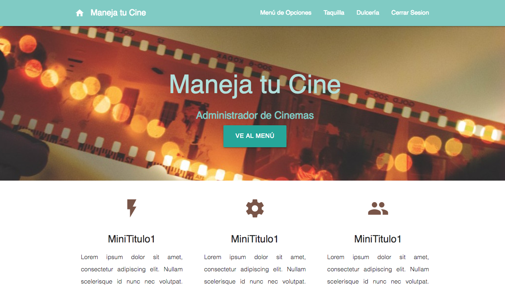
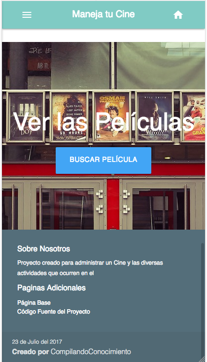
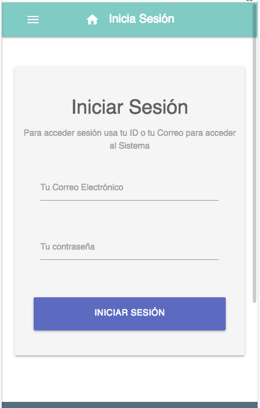
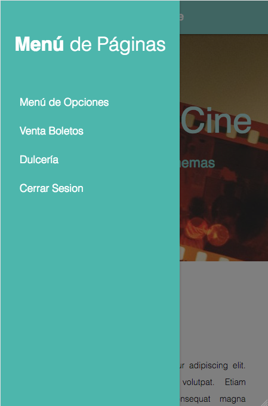
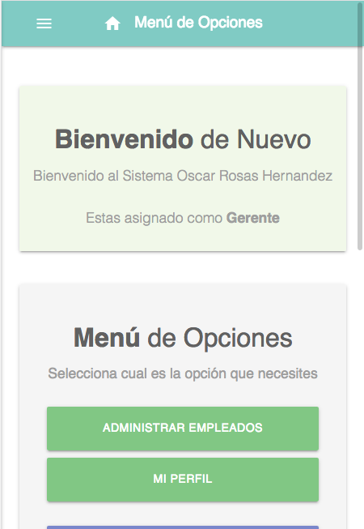
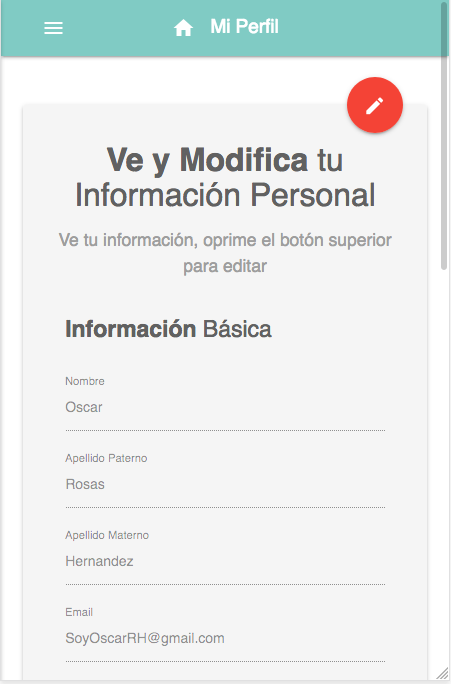
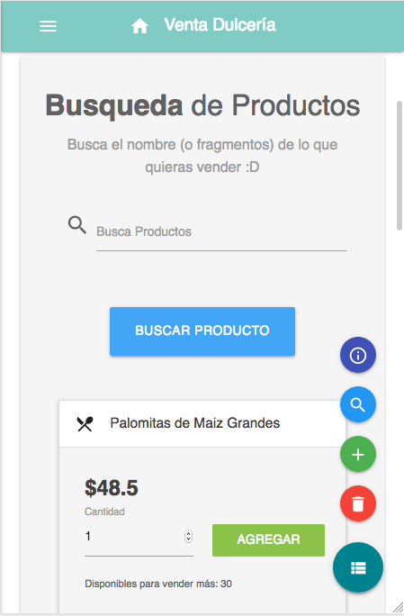
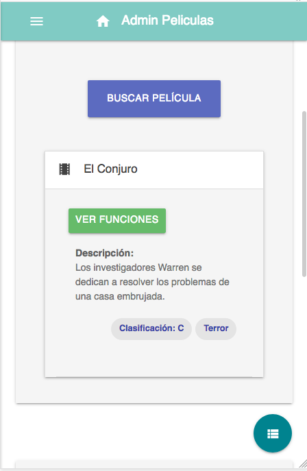
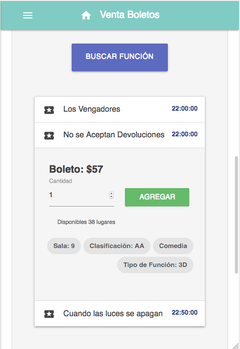

#  Manage Your Cinema

This is a UNFINISHED mini project for a webapp that can control a cinema: Creating
users and managing them, selling candy and popcorn, an the movie tickets.

All the code and documentation is in english, but all the text inside the app
is in spanish (my mother tongue).

  

## Getting Started

You are free to use this code for anything you want, for get you a copy of the project
up and running on your local machine you just need to have a web server active with PHP and
a DataBase un MySQL (inside documentation folder are the scripts).

### Built With

* [MaterializeCSS](http://materializecss.com/) - The web framework n.n (is amazing)
* [jQuery](https://jquery.com/) - Come on, I will not use raw Javascript

### Authors

* [SoyOscarRH](https://github.com/SoyOscarRH) - Oscar Andrés Rosas Hernandez

### License

This project is licensed under the GNU V2 License - see the [LICENSE.md](LICENSE.md) file
for details

  

## Showcase

Here I will show you some screenshots of the more important parts of the webapp. See how cute this is n.n

